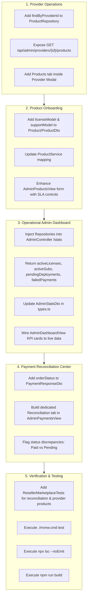

# OHO TECH Software Reseller Marketplace — Phase 3 Forensic Assessment

**Assessment Date**: October 2, 2026  
**Repository**: [Himansu-Nayak/OHOTECHN](https://github.com/Himansu-Nayak/OHOTECHN)  
**Authoritative Basis**: Master Rule — Repository is the Sole Source of Truth.

---

## 1. Executive Summary & Purpose

This forensic report assesses the operational readiness of the OHO TECH software reseller marketplace across commercial operations, payment gateways, product onboarding, deployments, developer infrastructure, customer portals, and audit trails.

Every finding below is derived directly from the verified code, entities, DTOs, controllers, services, database constraints, frontend views, and tests in the repository.

---

## 2. Forensic Codebase Inventory

### 2.1 Backend Architecture
- **Framework**: Spring Boot 4.0 on Java 21 LTS with Maven (`./mvnw.cmd`).
- **Data Persistence**: Spring Data JPA / Hibernate Core 7.4.1 over PostgreSQL 17 on port 5432 (`jdbc:postgresql://localhost:5432/OHOTECH`).
- **Connection Management**: HikariCP connection pool with MXBean telemetry (`activeConnections`, `maxConnections`).
- **Security & RBAC**: Stateless JWT architecture (`JwtTokenProvider`, `JwtAuthenticationFilter`, `SecurityConfig.java`) with role-based authority checks:
  - `ROLE_CUSTOMER`: Restricted to own purchases, owned cryptographic licenses, device seat activations, and owned deployment status.
  - `ROLE_DEVELOPER`: Technical operations, system diagnostics, API keys, webhook simulators, and engineering deployment transitions. Prohibited from accessing provider wholesale splits and payment secrets.
  - `ROLE_ADMIN`: Unrestricted commercial, financial, and operational authority.

### 2.2 Entity & Data Model Analysis

| Entity | Primary Attributes | Relationship Mapping | Security & Boundary Findings |
|---|---|---|---|
| **`Product.java`** | `id`, `name`, `slug`, `description`, `price`, `providerCost`, `resellerMargin`, `integrationStatus`, `deploymentType`, `lifecycleStatus`, `demoUrl`, `documentationUrl`, `featured`, `stock`, `active` | `@ManyToOne Provider`, `@ManyToOne Category` | `providerCost` and `resellerMargin` are explicitly isolated in `ProductService.mapToPublicDto()` and never serialized to public or customer DTOs. |
| **`Provider.java`** | `id`, `name`, `companyName`, `contactPerson`, `contactEmail`, `contactPhone`, `website`, `commercialTerms`, `commissionRate`, `technicalIntegrationType`, `integrationStatus`, `supportResponsibility`, `deploymentResponsibility`, `contractStatus`, `notes`, `active` | `@OneToMany products` | Internal operational entity. Public and customer APIs have 0 endpoints exposing `Provider` records. Gated strictly to `ROLE_ADMIN`. |
| **`Deployment.java`** | `id`, `order`, `product`, `user`, `license`, `status`, `targetEnvironment`, `accessUrl`, `assignedEngineer`, `adminNotes`, `customerNotes`, `completedAt` | `@OneToOne Order`, `@ManyToOne Product`, `@ManyToOne User`, `@OneToOne License` | State machine: `PENDING` → `ASSIGNED` → `CONFIGURING` → `TESTING` → `READY` → `LIVE`. Customer DTO nullifies `adminNotes`, `providerId`, and `providerName`. |
| **`Order.java`** | `id`, `user`, `totalAmount`, `status`, `paymentMethod`, `paymentStatus`, `items`, `invoices`, `createdAt` | `@ManyToOne User`, `@OneToMany items` | Core commercial record. Transition to `PAID` triggers automated license, subscription, and deployment provisioning. |
| **`Payment.java`** | `id`, `order`, `razorpayOrderId`, `razorpayPaymentId`, `razorpaySignature`, `amount`, `status`, `provider`, `method`, `currency`, `transactionReference`, `verifiedBy`, `verifiedAt` | `@OneToOne Order` | Implements server-side HMAC-SHA256 signature verification, UTR deduplication (`findDuplicateVerifiedUtr`), and administrative approval. |
| **`License.java`** | `id`, `licenseKey`, `user`, `product`, `subscription`, `order`, `status`, `maxDevices`, `activatedDevicesCount` | `@ManyToOne User`, `@ManyToOne Product`, `@OneToOne Subscription` | Authoritative cryptographic key generation (`OHO-XXXX-XXXX-XXXX`). Enforces hardware seat limits via `DeviceActivation`. |
| **`Subscription.java`**| `id`, `user`, `product`, `order`, `status`, `billingCycle`, `currentPeriodStart`, `currentPeriodEnd`, `autoRenew` | `@ManyToOne User`, `@ManyToOne Product`, `@ManyToOne Order` | Manages software renewal cycles, recurring entitlement checks, and grace periods. |
| **`User.java`** | `id`, `name`, `email`, `officialEmail`, `phone`, `role`, `enabled`, `emailVerified`, `phoneVerified` | Role enum: `ROLE_CUSTOMER`, `ROLE_ADMIN`, `ROLE_DEVELOPER`, `ROLE_SUPPORT` | Gated by BCrypt password encryption and rate limiting. |

---

## 3. Forensic Flow & Architecture Audit

### 3.1 Commercial Customer Purchase Flow
1. **Catalog Selection**: Customer browses products via `/products` (`GET /api/products`). Zero wholesale costs or agency names are returned.
2. **Checkout & Order Creation**: Customer initiates checkout via `/checkout` (`POST /api/orders`). Order enters `PENDING` state with itemized line totals.
3. **Payment Initiation**:
   - For Online Gateway: Razorpay order created via `POST /api/payments/create-order` using server-side Razorpay SDK.
   - For Direct UPI / Wire: Customer submits manual UTR reference via `POST /api/payments/submit-utr`.
4. **Payment Verification**:
   - Razorpay: Client returns payment ID and signature; server verifies HMAC-SHA256 in `PaymentService.verifyPayment()`.
   - Direct UPI / Wire: Admin reviews bank statement and approves payment via `PUT /api/admin/payments/{id}/verify`.
5. **Entitlement & Provisioning Dispatch**:
   - `PaymentService.createEntitlementsForOrder()` executes atomically:
     - Sets order to `CONFIRMED` / `PAID`.
     - Generates active `License` and `Subscription`.
     - Inserts `Deployment` record in `PENDING` state.
     - Dispatches provisioning to `SoftwareProvisioningService`.
     - Clears user cart and sends notification emails.
6. **Customer Software Center**: Customer views instance in `/my-products`. When status reaches `LIVE`, the "Launch Application" button activates with `accessUrl`.

### 3.2 Payment Gateway Center & Reconciliation Audit
- **Razorpay**: Fully operational via server-side credentials (`RAZORPAY_KEY_ID`, `RAZORPAY_KEY_SECRET`). Signature verification algorithm uses `Mac.getInstance("HmacSHA256")` comparing against order ID + payment ID.
- **Direct Bank Transfer / UPI**: Supported with unique UTR tracking, duplicate UTR prevention, and manual admin verification.
- **Cash on Delivery (COD)**: Supported for physical appliances and enterprise setup kits.
- **Other Gateways (Stripe, PayPal, PayU, PhonePe)**: NOT CONFIGURED in the backend. They must NOT be displayed as active or selectable in the production UI to prevent transaction failures.
- **Reconciliation Audit Finding**: `PaymentResponseDto` currently lacks the associated `orderStatus` string from `order.getStatus()`. Populating `orderStatus` in `mapPaymentToDto` enables a real-time reconciliation table highlighting mismatches (e.g., Payment `COMPLETED` but Order `PENDING`).

### 3.3 Admin Deployment Operations
- Existing deployment queue in `AdminDeploymentsView.tsx` supports filtering by `status`, `targetEnvironment`, and full-text search across `#DEP-id`, customer, product, engineer, and provider agency.
- Provider agency column (`providerName`) is visible exclusively to administrators.
- Quick Handoff flow enforces that a valid `accessUrl` is configured before permitting status transition to `LIVE`.
- `adminNotes` is strictly withheld from customer-facing APIs (`CustomerDeploymentController.java` line 50).

### 3.4 Product Onboarding & Pricing Engine
- `Product.java` contains `price`, `providerCost`, `resellerMargin`, `deploymentType`, `integrationStatus`, `demoUrl`, `documentationUrl`, `featured`, and `stock`.
- Pricing validation: Server calculates `price = providerCost + resellerMargin` when both wholesale parameters are provided.
- Enhancement Opportunity: Adding `licenseModel` (e.g. Perpetual, SaaS Annual) and `supportModel` (e.g. In-House OHO 24/7, Shared SLA) to `Product.java` and `ProductDto.java` formalizes software reseller commercial structures.

### 3.5 Admin Dashboard Architecture
- Existing `/api/admin/stats` returns `totalProducts`, `totalOrders`, `totalUsers`, `totalQuotes`, `totalRevenue`, `systemStatus`.
- Enhancement: Augmenting `/api/admin/stats` with `activeLicenses`, `activeSubscriptions`, `pendingDeployments`, `activeDeployments`, `failedPayments`, `activeProviders`, and `providerIssues` gives the Admin Dashboard 100% live backend backing with zero static placeholders.

---

## 4. Phase 3 Action Plan & Implementation Blueprint

---

## 5. Security Invariants (Non-Negotiable)

1. `providerCost` and `resellerMargin` MUST NEVER appear in `PublicProductDto`, `/api/products/**`, `/api/deployments/my`, or `/my-products`.
2. Provider identity (`providerId`, `providerName`, `Provider`) MUST NEVER be returned to customers.
3. Cross-customer deployment inspection MUST yield HTTP 403 Forbidden.
4. All financial calculations (`price = providerCost + resellerMargin`) MUST be server-authoritative.
5. All sensitive operations (payment verification, status changes, role updates) MUST write to `AuditLog`.
